<p align="center">
  <strong>🔥 HapticPhonix (CHD)</strong>
</p>

<p align="center">
  Real-time speech &amp; lip-reading learning platform with haptic feedback for the deaf and hard-of-hearing community.
</p>

<p align="center">
  
  
  
  
  
  
  
</p>

---

## Overview

HapticPhonix helps people — especially those with hearing loss — learn speech through:

- **Lip reading** via MediaPipe Face Mesh + Google Gemini Vision
- **Haptic feedback** (phone vibrations) mapped to phonemes and speech patterns
- **Teacher / Student modes** for remote lesson delivery across devices
- **Speech-to-text** via ElevenLabs for real-time transcription and translation
- **AI coaching** via Snowflake Cortex multi-model LLMs for personalized progress feedback

The backend processes video and audio in real time, sending events to the frontend over WebSockets. The frontend drives the UI, connects to backend services, and triggers vibrations on mobile devices.

---

## System Architecture

```mermaid
graph TB
    subgraph Frontend["FRONTEND — Next.js 16 + React 19"]
        direction TB
        Landing["/ Landing Page"]
        Auth["(auth) Clerk Sign-In / Sign-Up"]

        subgraph Dashboard["Dashboard Routes — Protected by Clerk"]
            DashView["/dashboard — Main Viewer"]
            Teacher["/teacher — Teacher Controls"]
            Student["/student — Student Camera"]
            SpeechHaptic["/speech-haptic — Phone Haptic UI"]
            Lessons["/lessons — Lesson Browser"]
            Coach["/dashboard → Coach Tab"]
        end

        subgraph FComponents["Components"]
            VideoPlayer["VideoPlayer + LipMeshOverlay"]
            LipReadingP["LipReadingPanel"]
            TranscriptionP["TranscriptionPanel"]
            PitchP["PitchAnalysisPanel"]
            PhonemeT["PhonemeTimeline"]
            WaveViz["WaveVisualizer3D — Three.js"]
            SnowflakeUI["SnowflakeCoaching Panel"]
        end

        subgraph FHooks["Hooks"]
            useSH["useSpeechHaptic"]
            usePA["usePitchAnalysis"]
            useLH["useLaryngealHaptics"]
            useMP["useMediaPipe"]
        end
    end

    subgraph Backend["BACKEND — FastAPI + Python"]
        direction TB
        subgraph WSManagers["WebSocket Managers"]
            ConnMgr["ConnectionManager — /ws/video"]
            ViewMgr["ViewerManager — /ws/viewer"]
            HapticMgr["HapticEventManager"]
            SpeechMgr["SpeechHapticManager — /ws/speech-haptic"]
        end

        subgraph Processors["Processing Engines"]
            MP["MediaPipe Processor — Face Mesh"]
            LipEngine["Lip Reading Engine — Gemini Vision"]
            PhonemeEng["Phoneme Engine — Lesson Playback"]
            SpeechPipe["Speech-Haptic Pipeline — Mic to STT"]
            TTS["TTS Service — Voice Cues"]
            SnowCoach["Snowflake Coach — Cortex LLM"]
        end
    end

    subgraph External["EXTERNAL SERVICES"]
        MediaPipeModel["MediaPipe face_landmarker"]
        Gemini["Google Gemini API"]
        ElevenLabs["ElevenLabs API"]
        Snowflake["Snowflake Cortex"]
        ClerkAuth["Clerk Auth"]
    end

    Student -->|"ws/video — send frames"| ConnMgr
    DashView -->|"ws/viewer — receive events"| ViewMgr
    Teacher -->|"ws/viewer — receive events"| ViewMgr
    SpeechHaptic -->|"ws/speech-haptic — receive haptics"| SpeechMgr
    Coach -->|"REST /api/coaching-*"| SnowCoach

    ConnMgr --> MP
    MP --> LipEngine
    MP --> PhonemeEng
    PhonemeEng --> HapticMgr
    HapticMgr --> ViewMgr
    SpeechPipe --> SpeechMgr

    MP -.-> MediaPipeModel
    LipEngine -.-> Gemini
    SpeechPipe -.-> ElevenLabs
    TTS -.-> ElevenLabs
    SnowCoach -.-> Snowflake
    Auth -.-> ClerkAuth
```



---

## Tech Stack

| Layer | Technologies | How We Use It |
|---|---|---|
| **Frontend** | Next.js 16, React 19, TypeScript 5, Tailwind CSS 4 | App Router with protected dashboard routes, server/client components, responsive UI |
| **3D & Animation** | Three.js, React Three Fiber, React Three Drei, Framer Motion, GSAP | `WaveVisualizer3D` renders real-time haptic waveforms; Framer Motion drives dashboard animations |
| **Authentication** | Clerk (`@clerk/nextjs` 6) | Sign-in/sign-up flows, middleware-enforced route protection for `/dashboard`, `/teacher`, `/student`, `/lessons` |
| **Backend** | FastAPI 0.118, Uvicorn, Python 3.11+ | REST endpoints + WebSocket handlers for real-time bidirectional communication |
| **Computer Vision** | MediaPipe Face Mesh 0.10, OpenCV | `MediaPipeProcessor` extracts 468 face landmarks, lip bounding boxes, and mouth-state from video frames |
| **Lip Reading AI** | Google Gemini Vision (`google-genai`) | Cropped lip-region frames are buffered and sent to Gemini every ~3s for text/phoneme recognition |
| **Speech-to-Text** | ElevenLabs STT (`scribe_v2`) | Real-time mic capture → ElevenLabs transcription → chunked text + haptic intensity mapping |
| **Text-to-Speech** | ElevenLabs TTS | Generates voice cues ("Listening started") broadcast to connected phones |
| **Translation** | Google Gemini | Transcribed speech is sent to Gemini for multi-language translation |
| **AI Coaching** | Snowflake Cortex (Mistral Large, Llama 3 70B, Mixtral 8×7B) | Personalized coaching feedback after practice sessions, phoneme tips, session trend analysis |
| **Audio Analysis** | PyAudio, Web Audio API, Praat-Parselmouth | Backend mic capture; frontend pitch analysis via `usePitchAnalysis` for laryngeal haptic feedback |
| **ML / Deep Learning** | TensorFlow 2.20, PyTorch 2.6, Transformers | Model inference support for vision and speech pipelines |
| **WebSockets** | FastAPI WebSocket, `websockets` 15 | Four WS endpoints managing video, viewer, haptic, and speech-haptic connections |
| **Icons & UI** | Lucide React | Consistent iconography across the dashboard |

---

## Project Structure

### Frontend

```
frontend/
├── app/                              # Next.js App Router
│   ├── page.tsx                      # Landing page (redirects signed-in users)
│   ├── layout.tsx                    # Root layout with ClerkProvider
│   ├── globals.css                   # Tailwind v4 theme (copper/dark palette)
│   ├── (auth)/                       # Public auth routes
│   │   ├── signIn/[[...sign-in]]/page.tsx
│   │   └── signUp/[[...sign-up]]/page.tsx
│   ├── (dashboard)/                  # Protected routes (Clerk middleware)
│   │   ├── dashboard/page.tsx        # Main viewer — video, lip reading, haptics, coaching
│   │   ├── teacher/page.tsx          # Teacher controls & lesson playback
│   │   ├── student/page.tsx          # Student camera + local pitch haptics
│   │   ├── speech-haptic/page.tsx    # Phone-only speech → haptic UI
│   │   └── lessons/page.tsx          # Lesson browser
│   └── api/                          # Next.js API routes
│       ├── lessons/route.ts
│       ├── socket/route.ts
│       └── webhooks/clerk/route.ts
├── components/
│   ├── VideoPlayer.tsx               # Camera frame display + landmark overlay
│   ├── LipMeshOverlay.tsx            # Lip mesh wireframe renderer
│   ├── LipReadingPanel.tsx           # Gemini lip reading results
│   ├── ConnectionStatus.tsx          # WS connection indicator
│   ├── PitchAnalysisPanel.tsx        # Real-time pitch visualization
│   ├── RecordingControls.tsx         # Record & replay sessions
│   ├── TranscriptionPanel.tsx        # ElevenLabs STT + Gemini translation
│   ├── PhonemeTimeline.tsx           # Phoneme sequence display
│   ├── SnowflakeCoaching.tsx         # AI coaching panel (Snowflake Cortex)
│   ├── WaveVisualizer3D.tsx          # Three.js haptic wave visualization
│   ├── HapticFeedback.tsx            # Vibration pattern display
│   ├── LaryngealHapticsPanel.tsx     # Laryngeal feedback controls
│   ├── Audiogram.tsx                 # Hearing profile
│   ├── ParticleBackground.tsx        # Landing page particles
│   └── ui/navbar.tsx                 # Navigation bar
├── hooks/
│   ├── useSpeechHaptic.ts            # Speech-haptic WS + pipeline API
│   ├── usePitchAnalysis.ts           # Local mic → pitch extraction
│   ├── useLaryngealHaptics.ts        # Pitch → haptic vibration patterns
│   ├── useMediaPipe.ts               # Client-side MediaPipe
│   ├── useSocket.ts                  # Generic WebSocket hook
│   └── useVibration.ts               # Vibration API wrapper
├── lib/
│   ├── storage.ts                    # Session recording storage
│   ├── pitchAnalysis.ts              # Pitch detection utilities
│   ├── laryngealHaptics.ts           # Haptic mapping logic
│   ├── mediapipe.ts                  # MediaPipe config
│   ├── haptics.ts                    # Haptic pattern helpers
│   └── socket.ts                     # Socket configuration
├── types/index.ts                    # Shared TypeScript types
├── middleware.ts                     # Clerk route protection
└── public/                           # Static assets
```

### Backend

```
backend/
├── main.py                           # FastAPI app — all routes & WS handlers
├── websocket_server.py               # Connection managers (5 managers)
├── mediapipe_processor.py            # MediaPipe Face Mesh processing
├── lip_reading.py                    # Gemini Vision lip reading engine
├── phoneme_engine.py                 # Lesson playback & phoneme timing
├── speech_haptic_pipeline.py         # Mic → ElevenLabs STT → haptic output
├── tts_service.py                    # ElevenLabs TTS for voice cues
├── snowflake_coach.py                # Snowflake Cortex AI coaching
├── haptic_patterns.py                # Vibration pattern definitions
├── config.py                         # App configuration
├── face_landmarker.task              # MediaPipe model file
├── requirements.txt                  # Python dependencies
├── .env.local                        # Environment variables
└── lessons/
    └── sample_lesson.json            # Phoneme sequence with timing data
```

---

## Data Flows

### 1. Video Pipeline (Student → Backend → Viewers)

```
Student Phone Camera
    │ base64 frames via /ws/video
    ▼
┌─ Backend ─────────────────────────────┐
│  MediaPipe Face Mesh                  │
│   → 468 landmarks + lip bounding box  │
│   → mouth openness + state            │
│                                       │
│  Lip Reading Engine                   │
│   → crop lip region → buffer frames   │
│   → Gemini Vision every ~3s           │
│   → text, confidence, phonemes        │
└───────────────────────────────────────┘
    │ broadcast via /ws/viewer
    ▼
Dashboard / Teacher (frames + landmarks + lip reading)
```

### 2. Lesson / Phoneme Pipeline

```
JSON Lesson File (phonemes + timing)
    │ POST /lessons/load/{name}
    ▼
PhonemeEngine → background playback loop
    │ phoneme becomes active
    ▼
HapticEventManager → builds vibration pattern
    │ broadcast to /ws/viewer
    ▼
All clients call navigator.vibrate(pattern)
```

### 3. Speech-Haptic Pipeline (Teacher Voice → Student Phone)

```
Teacher Mic
    │ POST /api/speech-haptic/start
    ▼
PyAudio capture → ElevenLabs STT
    │ text chunks + RMS intensity
    ▼
SpeechHapticPipeline
    │ maps intensity → haptic pattern
    │ broadcast via /ws/speech-haptic
    ▼
Student Phone vibrates + shows transcript
```

There is also a fast "volumetric" path that triggers haptics directly from RMS **before** STT completes, ensuring near-zero-latency feedback.

### 4. AI Coaching Pipeline (Snowflake Cortex)

```
Practice Session Data (phonemes, scores, struggles)
    │ POST /api/coaching-feedback
    ▼
Snowflake Coach
    │ builds context-aware prompt
    │ calls SNOWFLAKE.CORTEX.COMPLETE()
    │ model: mistral-large / llama3-70b / mixtral-8x7b
    ▼
Personalized feedback → Dashboard Coach Tab
    ├── Encouragement
    ├── Focus areas
    └── Next steps
```

### 5. Transcription & Translation

```
Browser mic → RecordingControls
    │ audio blob
    ▼
POST /api/transcribe → ElevenLabs STT
    │ transcript text
    ▼
POST /api/translate → Gemini
    │ translated text
    ▼
Dashboard displays both
```

---

## Routes & Roles

| Route | Purpose | Protection |
|---|---|---|
| `/` | Landing page; redirects signed-in users to `/dashboard` | Public |
| `/dashboard` | Main viewer: live video, lip reading, haptic log, phoneme timeline, AI coaching | Clerk |
| `/teacher` | Teacher controls, lesson playback, transcription, haptic triggers | Clerk |
| `/student` | Student phone: camera feed, local pitch → haptics, remote speech-haptic | Clerk |
| `/speech-haptic` | Phone-only UI for receiving speech → haptic events | Clerk |
| `/lessons` | Lesson browser and content | Clerk |

---

## WebSocket Endpoints

| Endpoint | Client | Direction | Purpose |
|---|---|---|---|
| `/ws/video` | Student phone | Phone → Backend | Send camera frames, receive processed frames back |
| `/ws/viewer` | Dashboard / Teacher | Backend → Client | Receive frames, haptic events, lip reading results, speech analysis |
| `/ws/speech-haptic` | Student phone | Backend → Phone | Receive speech-haptic events and TTS cues |

---

## REST API Endpoints

| Endpoint | Method | Purpose |
|---|---|---|
| `/` | GET | Server status and connection counts |
| `/health` | GET | Health check |
| `/lessons` | GET | List available lesson JSON files |
| `/lessons/load/{name}` | POST | Load lesson into phoneme engine |
| `/playback/start` | POST | Start lesson playback |
| `/playback/pause` | POST | Pause lesson playback |
| `/playback/resume` | POST | Resume lesson playback |
| `/playback/stop` | POST | Stop lesson playback |
| `/playback/status` | GET | Current playback status |
| `/haptic/test` | POST | Send test haptic to all devices |
| `/api/lip-read` | POST | On-demand lip reading (single frame) |
| `/api/lip-read/history` | GET | Lip reading history |
| `/api/transcribe` | POST | ElevenLabs transcription |
| `/api/translate` | POST | Gemini translation |
| `/api/speech-haptic/start` | POST | Start speech-haptic pipeline |
| `/api/speech-haptic/stop` | POST | Stop pipeline |
| `/api/speech-haptic/status` | GET | Pipeline status |
| `/api/coaching-feedback` | POST | Snowflake Cortex coaching feedback |
| `/api/phoneme-tip/{phoneme}` | GET | Quick phoneme pronunciation tip |
| `/api/coaching/status` | GET | Coaching engine status & available models |
| `/api/coaching/trends` | GET | Multi-session trend analysis |

---

## Connection Managers

Defined in `websocket_server.py`:

| Manager | Role |
|---|---|
| **ConnectionManager** | Tracks phone connections on `/ws/video` |
| **ViewerManager** | Tracks dashboard/teacher connections on `/ws/viewer`; broadcasts frames, haptics, lip reading |
| **HapticEventManager** | Builds vibration patterns from phoneme events and triggers broadcasts |
| **SpeechAnalysisManager** | Handles speech analysis results and broadcasts to viewers |
| **SpeechHapticConnectionManager** | Tracks phones on `/ws/speech-haptic` and broadcasts speech-haptic events |

---

## Student Page: Dual Haptic Sources

The Student page combines two independent haptic paths:

| Source | How It Works |
|---|---|
| **Local pitch → haptics** | Device mic → Web Audio API pitch extraction (`usePitchAnalysis`) → mapped to haptic patterns (`useLaryngealHaptics`) for self-monitoring |
| **Remote speech-haptic** | `/ws/speech-haptic` → receives teacher speech as transcript chunks + vibration patterns (`useSpeechHaptic`) |

When both are active, **local pitch-based haptics take precedence** while the student is speaking; remote speech-haptic is used when the teacher is speaking.

---

## Environment Variables

### Frontend (`frontend/.env`)

| Variable | Purpose |
|---|---|
| `NEXT_PUBLIC_CLERK_PUBLISHABLE_KEY` | Clerk public key |
| `CLERK_SECRET_KEY` | Clerk server-side key |
| `NEXT_PUBLIC_CLERK_SIGN_IN_URL` | Sign-in route |
| `NEXT_PUBLIC_CLERK_SIGN_UP_URL` | Sign-up route |
| `NEXT_PUBLIC_CLERK_AFTER_SIGN_IN_URL` | Redirect after sign-in |
| `NEXT_PUBLIC_CLERK_AFTER_SIGN_UP_URL` | Redirect after sign-up |
| `NEXT_PUBLIC_API_URL` | Backend URL (default `http://localhost:8000`) |
| `NEXT_PUBLIC_WS_URL` | WebSocket URL |
| `GEMINI_API_KEY` | Google Gemini API key |
| `ELEVENLABS_API_KEY` | ElevenLabs API key |

### Backend (`backend/.env.local`)

| Variable | Purpose |
|---|---|
| `PORT` | Server port (default `8000`) |
| `CORS_ORIGIN` | Allowed CORS origin |
| `GEMINI_API_KEY` | Google Gemini — lip reading + translation |
| `ELEVENLABS_API_KEY` | ElevenLabs — STT and TTS |
| `SNOWFLAKE_ACCOUNT` | Snowflake account identifier |
| `SNOWFLAKE_USER` | Snowflake username |
| `SNOWFLAKE_PASSWORD` | Snowflake password |
| `SNOWFLAKE_MOCK_MODE` | Set `true` for demo without credentials |

---

## Getting Started

### Prerequisites

- **Node.js** 18+ and **npm**
- **Python** 3.11+
- API keys for Clerk, Gemini, and ElevenLabs

### Backend

```bash
cd backend
pip install -r requirements.txt

# Configure environment
cp .env.example .env.local
# Edit .env.local with your API keys

# Start the server
python main.py
# → Runs on http://localhost:8000
```

### Frontend

```bash
cd frontend
npm install

# Configure environment
# Edit .env with your Clerk and API keys

# Start development server
npm run dev
# → Runs on http://localhost:3000
```

### Quick Test

1. Open `http://localhost:3000` → sign in via Clerk
2. Navigate to `/dashboard` → see live video feed when a phone connects
3. Open `/student` on a phone (same network) → camera starts, haptics enabled
4. Open `/speech-haptic` on another phone → receives teacher speech as vibrations

---

## Summary

| What | How |
|---|---|
| **Frontend** | Next.js 16 app with Clerk auth, multiple roles (viewer, teacher, student, speech-haptic phone) |
| **Backend** | FastAPI with MediaPipe, Gemini, ElevenLabs, Snowflake, and 5 WebSocket managers |
| **Video** | Student phone → `/ws/video` → MediaPipe + lip reading → `/ws/viewer` |
| **Lessons** | JSON phonemes → PhonemeEngine → haptics to all viewers and phones |
| **Speech-haptic** | Teacher mic → ElevenLabs STT → chunks → `/ws/speech-haptic` → phone vibration |
| **Local haptics** | Student mic → Web Audio pitch → laryngeal haptic patterns on device |
| **AI Coaching** | Session data → Snowflake Cortex (Mistral/Llama/Mixtral) → personalized feedback |

Together, this supports **multi-device teaching and learning** with visual, audio, and haptic feedback channels.